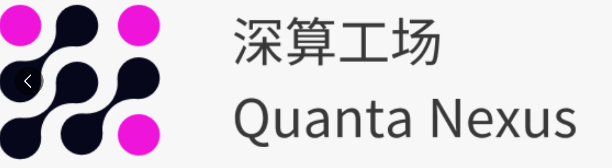

QuantaNexus 是海文公司基于 Kubernetes（K8S）平台开发的云算力管理软件，已实现对主流 CNI 插件的基础适配，并支持 Kubernetes 集群管理、kube-virt 虚拟化、Ceph 存储集成及异构计算（GPU/AI 芯片）调度等核心能力。目前已经经过大规模集群测试，支持万卡集群。

WEB Demo:  https://www.hi168.com   (公有云版)
申请测试： dev@hwua.com  

以下为详细功能支持详情：

## 一、QuantaNexus 对主流 CNI 插件的功能支持

| **功能模块**    | **CNI 插件类型**              | flannel | calico | cilium | kube-ovn | kube-router |
| ----------- | ------------------------- | ------- | ------ | ------ | -------- | ----------- |
| **基础支持**    | QuantaNexus 适配 + CNI 原生能力 | √       | √      | √      | √        | √           |
| **网络配置能力**  | 静态 IP（Static IP）          | X       | √      | X      | √        | X           |
|             | BGP 协议                    | X       | √      | √      | √        | 暂不支持        |
|             | VPC 网络隔离                  | X       | X      | X      | 暂不支持     | X           |
| **服务与负载管理** | LB + IPAM 集成              | X       | √      | √      | X        | X           |
|             | DSR（直接服务器返回）              | X       | √      | √      | X        | X           |
| **网络扩展能力**  | 双栈网络（Double Stack）        | 暂不支持    | 暂不支持   | 暂不支持   | 暂不支持     | 暂不支持        |
|             | 网关（Gateway）管理             | X       | 暂不支持   | 暂不支持   | X        | X           |
|             | 集群网格（Cluster Mesh）        | X       | 暂不支持   | 暂不支持   | X        | X           |

## 二、QuantaNexus 对 Kubernetes、kube-virt、Ceph 及异构计算的支持说明

### 2.1  Kubernetes（K8s）版本支持

QuantaNexus 从 **Kubernetes 1.28 版本**开始提供完整适配支持，包括但不限于：

*   集群生命周期管理（部署、升级、运维监控）；

*   核心资源（Pod、Deployment、Service、ConfigMap 等）的可视化管理与调度优化；

*   与 K8s 原生 API 完全兼容，支持自定义资源（CRD）扩展。

### 2.2  kube-virt 虚拟化支持

基于 K8s 1.28+ 版本基础，QuantaNexus 已实现对 kube-virt 的深度适配，支持能力包括：

*   虚拟机（VM）与容器的统一调度与管理，可通过 QuantaNexus 界面创建、启动、停止、删除 VM 实例；

*   VM 资源（CPU、内存、存储、网络）的动态配置与监控；

*   虚拟机镜像管理（支持从镜像仓库拉取、本地导入镜像）；

*   容器与 VM 之间的网络互通（依赖已适配的 CNI 插件实现）。

### 2.3  Ceph 存储支持

QuantaNexus 针对 Ceph 存储系统提供全面集成，支持 Ceph 作为 K8s 集群及 kube-virt 虚拟机的后端存储，具体支持模块如下：

| **Ceph 功能模块** | **支持状态** | **核心能力说明**                                                              |
| ------------- | -------- | ----------------------------------------------------------------------- |
| Ceph RBD（块存储） | √        | 支持将 Ceph RBD 卷挂载为 K8s Pod 存储卷、kube-virt VM 系统盘 / 数据盘，支持动态卷创建（PVC）与快照管理  |
| CephFS（文件存储）  | √        | 支持 CephFS 作为共享存储，挂载至多个 Pod 或 VM，满足分布式应用的文件共享需求，支持权限控制与配额管理              |
| Rados（对象存储）   | √        | 支持通过 Rados API 或 S3 兼容接口，将 Ceph 作为对象存储服务，用于存储日志、备份数据等非结构化数据，支持容量监控与访问鉴权 |

### 2.4  异构计算（GPU/AI 芯片）支持

QuantaNexus 支持主流 AI 运算芯片的虚拟化与调度能力，可满足机器学习、深度学习等 AI 场景需求，具体支持列表及功能如下：

| **芯片厂商**    | **支持型号系列**                              | **核心支持功能**                                                                                          |
| ----------- | --------------------------------------- | --------------------------------------------------------------------------------------------------- |
| 英伟达（NVIDIA） | Tesla A10、Tesla T4 及全系 AI 运算芯片          | 1. 支持 GPU 显卡直通（Direct Passthrough）至 Pod/VM；2. 支持 VGPU 虚拟化（多实例共享 GPU 资源）；3. 兼容英伟达 CUDA 生态，保障 AI 运算性能 |
| 华为（HUAWEI）  | 升腾 310（Ascend 310）、升腾 910（Ascend 910）全系 | 1. 支持 AI 芯片直通至 Pod/VM，适配华为 Atlas 硬件生态；2. 支持 VGPU 虚拟化，实现资源弹性分配；3. 兼容华为 MindSpore 框架，支持 AI 任务调度与监控    |

## 三、标注说明

| **标注符号** | **QuantaNexus 功能支持状态说明**     |
| -------- | ---------------------------- |
| √        | 功能已完成适配，可直接在 QuantaNexus 中使用 |
| X        | 功能暂不支持（CNI 插件原生不支持或未纳入适配计划）  |
| 暂不支持     | 功能待适配（已纳入迭代计划，后续版本上线支持）      |

## 四、核心优势补充

1.  **基础适配全覆盖**：QuantaNexus 已实现对 K8s 1.28+、主流 CNI 插件、AI 芯片的基础适配，确保集群网络、计算、存储、异构资源层的稳定运行；

2.  **“计算 - 存储 - 虚拟化 - AI” 一体化**：深度集成 kube-virt、Ceph 与异构计算芯片，实现容器、虚拟机、存储、AI 资源的统一管理，降低多场景运维复杂度；

3.  **多生态兼容**：同时兼容英伟达 CUDA、华为 MindSpore 等主流 AI 生态，支持 VGPU 与显卡直通，满足不同 AI 业务的资源调度需求；

4.  **持续迭代规划**：后续将逐步扩展 K8s 更高版本（如 1.29、1.30）的适配，优化 AI 芯片性能监控、Ceph 存储灾备、kube-virt 高可用等功能，进一步完善生态支持。

