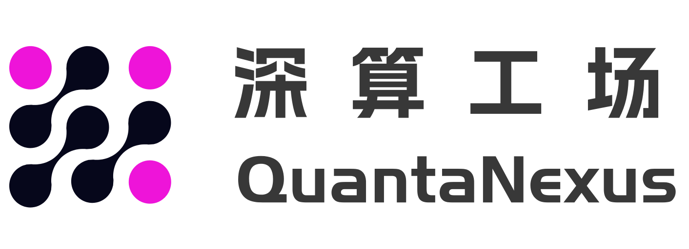

# QuantaNexus



QuantaNexus 是海文公司基于 Kubernetes（K8S）平台开发的云算力管理软件，已实现对主流 CNI 插件的基础适配，并支持 Kubernetes 集群管理、kube-virt 虚拟化、Ceph 存储集成及异构计算（GPU/AI 芯片）调度等核心能力。目前已经经过大规模集群测试，支持万卡集群；支持C2C商业运营，用户自己注册，充值算力自动申请VM和算力。支持声明式调度，支持队列式AI任务调度。

请帮忙点亮小星星和克隆.

gitee 镜像： <https://gitee.com/hwua/quantanexus.git>

WEB Demo:  <https://www.hi168.com>   (公有云版)

加入我们的[Slack](https://join.slack.com/t/hwua/shared_invite/zt-3e8immsaf-DQlHsdEfWsBpIe2UtttieQ)

QQ支持群： 574087153

测试： 您可以根据本文档进行测试。
Issue: 您可以在issue提出问题，我们会尽快回复，并解答。
开发计划： 我们会持续的开发底层基础设施。

个人版定义： 安装本平台默认是个人版，如果您想要企业版，请联系我们的客服。
个人版限制： 500个cpu核心，50个用户，已经足够个人使用。

以下为详细功能支持详情：

## 一、安装选项

QuantaNexus分为两个部分，一个是Quantanexus-mgr作为集群的控制平面，另外一个是QuantaNexus集群服务简称Quantanexus-cs，提供webshell，镜像提交，S3存储桶等功能。作为多集群控制平面，Quantanexus-mgr可以控制多个K8S集群服务（集群安装Quantanexus-cs组件即可）。当然，你也可以将两个组件安装在一个K8S集群中，尽可能将两套组件分开在不同的namespace中，但是公共组件例如:cert-manager,ingress-nginx,prometheus,grafana这些都是可以重用的。

### Quantanexus 依赖组件列表

安装 Quantanexus-mgr 需要预先安装以下核心组件：

| 组件名称 | 类型 | 必需性 | 说明 |
|---------|------|--------|------|
| cert-manager | 基础设施 | ✅ 必需 | 用于证书签发和管理，为集群提供 TLS 证书支持 |
| ingress-nginx | 基础设施 | ✅ 必需 | 提供 Kubernetes 集群的入口控制器，实现服务暴露和负载均衡 |
| prometheus | 监控 | ✅ 必需 | 集群监控和指标收集系统，用于监控集群和应用性能 |
| grafana | 监控 | ✅ 必需 | 数据可视化平台，用于展示 prometheus 收集的监控数据 |
| longhorn 或 ceph | 存储 | ✅ 必需 | longhorn 适用于测试环境，ceph 适用于生产环境 |


安装 Quantanexus-cs 需要预先安装以下核心组件：

| 组件名称 | 类型 | 必需性 | 说明 |
|---------|------|--------|------|
| longhorn 或 ceph | 存储 | ✅ 必需 | longhorn 适用于测试环境，ceph 适用于生产环境 |
| cert-manager | 基础设施 | ✅ 必需 | 用于证书签发和管理，为集群提供 TLS 证书支持 |
| ingress-nginx | 基础设施 | ✅ 必需 | 提供 Kubernetes 集群的入口控制器，实现服务暴露 |
| prometheus | 监控 | ✅ 必需 | 集群监控和指标收集系统，用于监控集群和应用性能 |
| grafana | 监控 | ✅ 必需 | 数据可视化平台，用于展示 prometheus 收集的监控数据 |
| harbor | 镜像仓库 | ✅ 必需 | 容器镜像仓库，用于存储和分发容器镜像 |
| minio 或 seaweedfs | 对象存储 | ⚠️ 可选 | 对象存储解决方案 |
| gpu-operator | AI | ⚠️ 可选 |仅在需要 GPU 调度时安装 |
| volcano | AI | ⚠️ 可选 | 仅在需要 AI 任务管理时安装 |

**说明：**

- ✅ 必需：安装 Quantanexus 的基本要求，必须提前部署。
- ⚠️ 可选：根据实际使用场景决定是否安装。
- 存储组件在测试环境中推荐使用 longhorn，生产环境建议使用 ceph。
- 对象存储组件(minio或seaweedfs)根据实际需求选择其一即可,最小安装状态下可以不用安装。

提供多种安装方式，以满足不同环境和需求：

### 1.0 k8s集群已经搭建完毕，并满足上述条件，则推荐使用一键安装方式

```bash
    helm repo add hi168 https://helm.hi168.com/charts/ 2>/dev/null
    helm repo update hi168

    # 安装 QuantaNexus-mgr 控制平面
    helm install quantanexus hi168/quantanexus-mgr --version 1.0.0 \
    --namespace quantanexus --create-namespace \
    --set global.domainName=qntest002.hi168.com \
    --set global.masterNode=master1 \
    --set "global.masterNodes=master1\,master2" \
    --set global.workerNodes=worker1    
    
    # 安装 QuantaNexus-cs 集群服务·
    helm install quantanexus-cs hi168/quantanexus-cluster-service --version 1.0.0 \
    --namespace quantanexus-cs --create-namespace \
    --set domainName=qntest002.hi168.com 

```
QutantaNexus-Mgr helm参数列表README.md(./install/test/helm/quantanexus-mgr/README.md)
QutantaNexus-CS  helm参数列表README.md(./install/test/helm/quantanexus-cs/README.md)

### 1.1 All-in-One 安装（从0开始）

适用于全新环境，一键安装完整的 Kubernetes 集群和 QuantaNexus 平台：

- 自动部署 Kubernetes 1.28+ 集群，可以使用./install/test/kubeeasz开源项目用来部署。
- 预配置网络插件可选 flannel、calico、cilium、kube-ovn，建议使用calico。
- 安装 kube-virt 虚拟化组件
- 集成 Ceph 存储系统（支持 Ceph 17+ 版本）或者Longhorn 存储系统（支持 Longhorn 1.5.x ）
- 预装 Prometheus 监控系统
- 自动配置 QuantaNexus-mgr 和 QuantaNexus-cs 核心服务

可以参考install/test/README.md(./install/test/README.md) 进行安装。

### 1.2 现有 Kubernetes 集群安装

适用于已有 Kubernetes 环境的用户，需确保集群版本在兼容列表内：

- **Kubernetes 兼容版本**：1.28.x、1.29.x、1.30.x
- **依赖组件检查**：
  - CNI 插件（查阅兼容列表）
  - kube-virt（建议版本 >= 0.57.0）
  - Ceph CSI 驱动（支持 Ceph 17+）
  - Prometheus 监控系统（建议版本 >= 2.40.0）
- QuantaNexus 控制平面部署
- 组件集成与配置优化

## 二、QuantaNexus 对主流 CNI 插件的功能支持

| **功能模块**    | **CNI 插件类型**              | flannel | calico | cilium | kube-ovn | kube-router |
| ----------- | ------------------------- | ------- | ------ | ------ | -------- | ----------- |
| **基础支持**    | QuantaNexus 适配 + CNI 原生能力 | √       | √      | √      | √        | √           |
| **网络配置能力**  | 静态 IP（Static IP）          | X       | √      | X      | √        | X           |
|             | BGP 协议                    | X       | √      | √      | √        | 暂不支持        |
|             | VPC 网络隔离                  | X       | X      | X      | 暂不支持     | X           |
| **服务与负载管理** | LB + IPAM 集成              | X       | √      | √      | X        | X           |
|             | DSR（直接服务器返回）              | X       | √      | √      | X        | X           |
| **网络扩展能力**  | 双栈网络（Double Stack）        | 暂不支持    | 暂不支持   | 暂不支持   | 暂不支持     | 暂不支持        |
|             | 网关（Gateway）管理             | X       | 暂不支持   | 暂不支持   | X        | X           |
|             | 集群网格（Cluster Mesh）        | X       | 暂不支持   | 暂不支持   | X        | X           |

## 三、QuantaNexus 对 Kubernetes、kube-virt、Ceph 及异构计算的支持说明

### 3.1  Kubernetes（K8s）版本支持

QuantaNexus 从 **Kubernetes 1.28 版本**开始提供完整适配支持，包括但不限于：

- 集群生命周期管理（部署、升级、运维监控）；
- 核心资源（Pod、Deployment、Service、ConfigMap 等）的可视化管理与调度优化；
- 与 K8s 原生 API 完全兼容，支持自定义资源（CRD）扩展。

### 3.2  kube-virt 虚拟化支持

基于 K8s 1.28+ 版本基础，QuantaNexus 已实现对 kube-virt 的深度适配，支持能力包括：

- 虚拟机（VM）与容器的统一调度与管理，可通过 QuantaNexus 界面创建、启动、停止、删除 VM 实例；
- VM 资源（CPU、内存、存储、网络）的动态配置与监控；
- 虚拟机镜像管理（支持从镜像仓库拉取、本地导入镜像）；
- 容器与 VM 之间的网络互通（依赖已适配的 CNI 插件实现）。

### 3.3  Ceph 存储支持

QuantaNexus 针对 Ceph 存储系统提供全面集成，全面支持Ceph并建议生产环境用Ceph 作为 K8s 集群及 kube-virt 虚拟机的后端存储。Ceph 版本支持情况如下：

**Ceph 版本支持矩阵**：

| Ceph 版本 | 支持状态 | 说明 |
|----------|---------|------|
| Ceph 16.x | ⚠️ 部分功能不可用 | 部分高级功能受限 |
| Ceph 17.x | ✅ 完全支持 | 所有功能正常运行 |
| Ceph 18.x | ✅ 完全支持 | 已通过全面测试 |
| Ceph 19.x | ✅ 完全支持 | 已通过全面测试 |

具体支持模块如下：

| **Ceph 功能模块** | **支持状态** | **核心能力说明**                                                              |
| ------------- | -------- | ----------------------------------------------------------------------- |
| Ceph RBD（块存储） | √        | 支持将 Ceph RBD 卷挂载为 K8s Pod 存储卷、kube-virt VM 系统盘 / 数据盘，支持动态卷创建（PVC）与快照管理  |
| CephFS（文件存储）  | √        | 支持 CephFS 作为共享存储，挂载至多个 Pod 或 VM，满足分布式应用的文件共享需求，支持权限控制与配额管理              |
| Rados（对象存储）   | √        | 支持通过 Rados API 或 S3 兼容接口，将 Ceph 作为对象存储服务，用于存储日志、备份数据等非结构化数据，支持容量监控与访问鉴权 |

### 3.4  异构计算（GPU/AI 芯片）支持

QuantaNexus 支持主流 AI 运算芯片的虚拟化与调度能力，可满足机器学习、深度学习等 AI 场景需求，具体支持列表及功能如下：

| **芯片厂商**    | **支持型号系列**                              | **核心支持功能**                                                                                          |
| ----------- | --------------------------------------- | --------------------------------------------------------------------------------------------------- |
| 英伟达（NVIDIA） | Tesla A10、Tesla T4 及全系 AI 运算芯片          | 1. 支持 GPU 显卡直通（Direct Passthrough）至 Pod/VM；2. 支持 VGPU 虚拟化（多实例共享 GPU 资源）；3. 兼容英伟达 CUDA 生态，保障 AI 运算性能 |
| 华为（HUAWEI）  | 升腾 310（Ascend 310）、升腾 910（Ascend 910）全系 | 1. 支持 AI 芯片直通至 Pod/VM，适配华为 Atlas 硬件生态；2. 支持 VGPU 虚拟化，实现资源弹性分配；3. 兼容华为 MindSpore 框架，支持 AI 任务调度与监控    |

## 四、标注说明

| **标注符号** | **QuantaNexus 功能支持状态说明**     |
| -------- | ---------------------------- |
| √        | 功能已完成适配，可直接在 QuantaNexus 中使用 |
| X        | 功能暂不支持（CNI 插件原生不支持或未纳入适配计划）  |
| 暂不支持     | 功能待适配（已纳入迭代计划，后续版本上线支持）      |

## 五、核心优势补充

1. **基础适配全覆盖**：QuantaNexus 已实现对 K8s 1.28+、主流 CNI 插件、AI 芯片的基础适配，确保集群网络、计算、存储、异构资源层的稳定运行；

2. **"计算 - 存储 - 虚拟化 - AI" 一体化**：深度集成 kube-virt、Ceph 与异构计算芯片，实现容器、虚拟机、存储、AI 资源的统一管理，降低多场景运维复杂度；

3. **多生态兼容**：同时兼容英伟达 CUDA、华为 MindSpore 等主流 AI 生态，支持 VGPU 与显卡直通，满足不同 AI 业务的资源调度需求；

4. **持续迭代规划**：后续将逐步扩展 K8s 更高版本（如 1.29、1.30）的适配，优化 AI 芯片性能监控、Ceph 存储灾备、kube-virt 高可用等功能，进一步完善生态支持。
